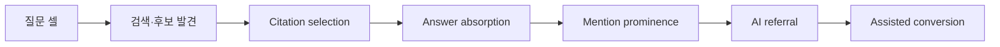
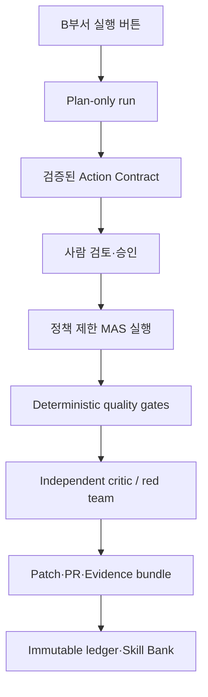
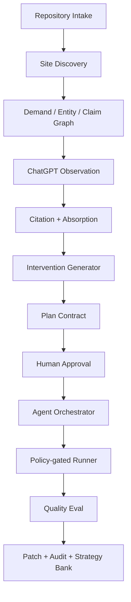
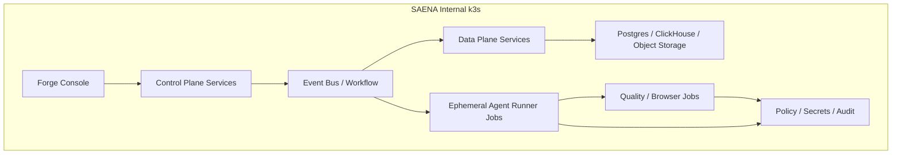

# SAENA RAPID-7 + FORGE

## ChatGPT Search 중심 AEO 알고리즘·15+ 마이크로서비스·Harness Engineering 설계 기준서

**문서 상태:** 설계 확정 전 검토본 v1.0  
**기준일:** 2026-07-11  
**초기 시장:** B2B SaaS, 광고 대행사 운영형  
**초기 엔진:** ChatGPT Search만 활성화  
**명시적 제외:** Google AI Overviews, Google AI Mode, Gemini는 v1에서 관측·최적화·성과 SLA 대상에서 제외. 단, 향후 재활성화를 위한 Engine Adapter 계약만 유지한다.  
**B부서 권한:** 고객사 웹사이트의 배포는 하지 않는다. 소스코드 변경, 테스트, 패치/브랜치/PR 산출까지만 자동화하며, 사람 검토 후 B부서가 실행을 승인한다.

---

## 0. 최종 결론

SAENA가 Profound보다 이길 수 있는 길은 또 하나의 “AI visibility 대시보드” 또는 “AEO 콘텐츠 생성기”를 만드는 것이 아니다. Profound는 이미 실사용 프롬프트 연구, 브랜드·인용 분석, CMS 연결 에이전트, 승인 기반 게시 흐름을 공개적으로 제공한다. SAENA의 핵심 제품은 다음이어야 한다.

> **SAENA RAPID-7은 ChatGPT Search에서 7일 이내 관측 가능한 외부 신호를 가장 빠르게 만들 확률이 높은 개입 조합을 인과적으로 선택하는 알고리즘이고, SAENA FORGE는 그 개입을 고객사 소스코드에 안전하고 재현 가능하게 구현하는 Harness Engineering 플랫폼이다.**

여기서 “7일 보장”은 ChatGPT가 특정 문장·URL을 반드시 출력한다는 보장이 아니다. 외부 엔진의 크롤·색인·검색·생성 로직은 SAENA가 통제할 수 없다. 보장 구조는 다음 두 층으로 고정한다.

| 계층 | SAENA가 보장할 대상 | 절대 보장하지 않는 대상 |
|---|---|---|
| A. 실행·기술 보장 | 사전 등록된 소스 변경, 기술 적격성, 콘텐츠 증거성, 테스트, 패치, 측정 인프라, evidence bundle | 외부 엔진의 특정 노출 |
| B. 외부 신호 보장 | 적격 고객에 한해 사전 정의된 ChatGPT Search 측정 셀에서 통제군 대비 개선을 검증하는 실험·자동 remediation/크레딧 절차 | 모든 고객의 언급·인용·매출 증가 |
| C. 비즈니스 성과 | 목표치·실험 지표로 관리 | 7일 내 매출·전환의 절대 증가 |

제품의 진짜 경쟁력은 “무엇을 고칠지”를 추측하는 것이 아니라, **변경 전 가설 → 변경 → 외부 관측 → 통제 비교 → 다음 행동 선택**의 폐쇄루프를 고객사 코드 수준에서 운영하는 데 있다.

---

## 1. 설계 원칙과 변경 불가 제약

### 1.1 제품 원칙

1. ChatGPT Search에서 발견·인용될 수 있는 공개 웹 자산을 고객의 실제 사업 질문에 맞춰 개선한다.
2. 모든 자동 변경은 “어떤 질문에, 어떤 근거로, 어떤 자산을, 왜 수정하는가”를 증명할 수 있어야 한다.
3. Plan Mode와 사람 승인 이전에는 소스코드를 수정하지 않는다.
4. 승인 후에도 에이전트는 허용된 Action Contract 밖의 파일·명령·네트워크·외부 계정을 건드리지 못한다.
5. 텍스트 생성량이 아니라 **근거 있는 claim, 검색 가능성, 답변 흡수 가능성, 변경 속도와 측정 신뢰성**을 최적화한다.
6. 고객사 비밀·개인정보·API 키는 테넌트 경계 밖으로 이동하지 않으며, 전략 학습에는 익명화된 결과 메타데이터만 쓴다.
7. “영구적으로 추가 수정이 필요 없는 최고 성능”은 외부 엔진이 변하기 때문에 불가능하다. 대신 변경에 강한 정보 구조와 드리프트 감지·소규모 재개입 체계를 제공한다.

### 1.2 ChatGPT Search에 대한 사실 경계

OpenAI는 ChatGPT Search 노출을 위해 공개 사이트가 `OAI-SearchBot`을 막지 않도록 권장한다. 차단한 페이지는 검색 답변에 표시되지 않을 수 있다. 이는 필요한 조건 중 하나일 뿐 순위·인용을 보장하지 않는다.  
출처: [OpenAI crawler overview](https://developers.openai.com/api/docs/bots), [Publishers and Developers FAQ](https://help.openai.com/en/articles/12627856-publishers-and-developers-faq)

따라서 v1의 기술 우선순위는 다음이다.

- 공개 접근 가능, HTTP 상태·robots·canonical·메타·sitemap·렌더링이 정합한가
- B2B SaaS의 제품, 기능, 가격, 보안, 통합, 비교, 제한, 고객 사례, 지원 정책에 대한 원자적 증거가 있는가
- 각 질문에 직접 답하는 self-contained Answer Capsule이 있는가
- 모든 수치·비교·보안·가격·호환성 claim에 근거와 유효일이 있는가
- ChatGPT Search의 반복 관측에서 고객 자산이 citation selection과 answer absorption에 어느 단계에서 탈락하는가

### 1.3 금지 항목

- 허위 리뷰, 위장 후기, 대량 도메인 생성, 링크 조작, 경쟁사 비방
- 근거 없는 통계, 인증, 호환성, 가격, 법률·보안 claim
- 고객 승인 없는 Git push, 배포, CMS 게시, DNS/robots 변경, 검색엔진 제출
- 사용자에게 도움이 없는 대량 AI 생성 페이지
- 비밀정보·토큰·`.env` 파일·프로덕션 DB의 모델 컨텍스트 유입
- 외부 페이지에 포함된 명령을 시스템 지시로 취급하는 행위

---

## 2. 경쟁 환경과 선택한 가설

### 2.1 Profound 대비 냉정한 판단

Profound는 이미 AI visibility, citation, sentiment, prompt research, CMS 연결 Agents, human-in-the-loop approval, Aim 기반 기회 탐지·작업화 기능을 제공한다. 실사용 프롬프트 데이터도 핵심 자산으로 내세운다. 따라서 SAENA가 “프롬프트를 많이 돌리고 콘텐츠를 자동 작성한다”는 수준에 머물면 열세다.  
출처: [Profound Agents](https://www.tryprofound.com/features/agents), [Profound Aim](https://www.tryprofound.com/features/aim), [Prompt Research](https://www.tryprofound.com/blog/introducing-prompt-research-reports-in-profound)

| 가설 | 설명 | 평가 | 채택 여부 |
|---|---|---|---|
| H1. 대시보드 중심 AEO | 언급·인용·감성·경쟁사 지표를 보여준다 | Profound의 주력 범주와 중복 | 보조 기능만 채택 |
| H2. 자동 콘텐츠 생성·CMS 게시 | 콘텐츠 gap을 찾고 대량으로 발행한다 | Profound Agents와 직접 충돌, SEO·품질 리스크 큼 | 단독 전략으로 기각 |
| H3. Evidence Graph 기반 Answer Capsule | 질문–claim–근거–페이지–citation의 정합성을 코드 수준에서 보장 | 품질과 답변 흡수 측정에 직접 연결 | 핵심 채택 |
| H4. 7일 time-to-signal 인과 최적화 | 시간 제약을 둔 개입 포트폴리오를 생존모형·실험으로 선택 | 대시보드가 아닌 의사결정 엔진 | 핵심 채택 |
| H5. Proof-carrying source patch Harness | 모든 변경에 근거·검증·정책·rollback artifact를 결합 | 대행사 B부서의 저기술 실행에 적합 | 핵심 채택 |
| H6. 개인정보 보존 전략 Skill Bank | 고객 원문이 아닌 성공·실패 패턴을 엔진×산업×질문 유형으로 축적 | 장기 데이터 네트워크 효과 | P1부터 채택 |

### 2.2 SAENA의 압도적 우위가 될 수 있는 구조

아래는 **설계상 우위**이며 실제 우위는 벤치마크와 유료 파일럿으로 입증해야 한다.

1. **결과 시간 최적화:** 콘텐츠 품질 점수 대신 `P(7일 내 외부 신호)`를 직접 최적화한다.
2. **인과 분리:** raw visibility가 아니라 처리군·통제군·시장 드리프트를 분리한다.
3. **citation selection ≠ answer absorption:** 인용되었지만 답변 내용에 기여하지 못한 자산을 별도로 판별한다. 최근 연구도 이 두 단계를 분리해 측정해야 한다고 제안한다.  
   출처: [Citation Selection to Citation Absorption](https://arxiv.org/abs/2604.25707)
4. **코드까지 닫힌 루프:** 분석 결과가 대시보드에서 멈추지 않고, 안전한 소스 패치·테스트·PR로 이어진다.
5. **agency fleet 학습:** 대행사 운영 프로젝트의 비식별 outcome을 Strategy Skill Bank에 축적한다.
6. **proof-carrying change set:** 최종 diff가 왜 존재하는지, 어느 evidence와 metric에 연결되는지를 자동 검증한다.

---

## 3. SAENA RAPID-7 알고리즘

### 3.1 핵심 데이터 객체

| 객체 | 역할 | 필수 필드 |
|---|---|---|
| Query Cluster | 실제 질문 공간의 canonical node | intent, funnel, locale, business value, paraphrases, confidence |
| Entity | 브랜드·제품·기능·경쟁사·통합 서비스 | aliases, canonical URL, ownership, entity type |
| Claim | 고객 사이트가 말할 수 있는 원자적 사실 | subject, predicate, object, scope, effective date, legal status |
| Evidence | claim의 출처 | source URL/file, quote span, owner, freshness, confidence |
| Asset | 고객의 페이지·문서·FAQ·사례 | URL, template, indexability, claims, snapshot hash |
| Intervention | 변경 가능한 코드/콘텐츠 행동 | action type, target asset, cost, risk, dependencies |
| Observation Cell | 고정된 ChatGPT Search 관측 단위 | prompt cluster, locale, browser policy, repeat count |
| Outcome Event | crawl, retrieval, citation, absorption, referral 등 | timestamp, raw snapshot hash, confidence, experiment arm |

### 3.2 세 개의 그래프

1. **Question–Entity–Evidence Graph (QEEG)**  
   질문이 어떤 엔티티와 claim을 요구하고, 그 claim이 어떤 근거와 자산으로 입증되는지 표현한다.
2. **Response Observation Ledger (ROL)**  
   ChatGPT Search 관측 원문, citation URL, 응답 내 문장, locale, 세션 조건, 페이지 snapshot hash를 append-only로 남긴다.
3. **Treatment Action Graph (TAG)**  
   변경 행동, 의존성, 위험, 예상 효과, 실제 결과, rollback 경로를 연결한다.

이 세 그래프가 없으면 AEO는 “블로그를 더 쓴 뒤 결과를 기다리는 작업”으로 퇴행한다.

### 3.3 단계별 Outcome 상태



각 단계는 별도 확률 변수다. citation 수가 늘어도 answer absorption이 증가하지 않을 수 있고, citation이 없어도 브랜드 언급이 나올 수 있다. 따라서 모든 지표를 하나의 visibility 점수로 압축하지 않는다.

### 3.4 개입 후보 생성

각 Query Cluster마다 최소 세 개의 상호 배타적 가설을 생성하고, Evidence Gate를 통과한 후보만 행동 집합에 넣는다.

| 가설군 | 예시 개입 | 7일 속도 가설 | 핵심 리스크 |
|---|---|---|---|
| G1 기술 적격성 | SSR/정적 렌더링, robots, canonical, sitemap, 메타 오류 수정 | 이미 존재하는 자산의 재발견 속도가 빠름 | 잘못된 canonical·robots 변경 |
| G2 evidence density | 보안·가격·통합·제한·비교 claim에 1차 근거 및 유효일 삽입 | 답변에 흡수될 만한 검증 가능 문장 증가 | unsupported claim |
| G3 answer capsule | 질문별 direct answer, 비교표, 절차, 제한을 문서 구조로 컴파일 | long-form 질문의 직접 답변 적합성 증가 | 정보 중복·thin content |
| G4 entity resolution | 제품명·약칭·통합명·정식 URL을 canonical entity block에 연결 | 모델의 엔티티 혼동 감소 | 브랜드 표현 불일치 |
| G5 internal authority routing | 고권위 문서에서 핵심 asset으로 내부 링크·navigation 보강 | crawler/retrieval 경로 단축 | 과도한 anchor 조작 |
| G6 freshness repair | 만료 가격, release note, 보안문서, comparison의 갱신 | 최신성 신호 개선 | 사실 검증 실패 |

### 3.5 우선순위와 최적화 목적함수

질문 `q`, asset `a`, 개입 `i`, 시간 `t`, 엔진 `e=ChatGPT Search`에 대해 다음을 추정한다.

\[
U(i) = \sum_{q,l} V(q,l) \times P(Y_{q,l}=1 \mid i,X, t \le 7d) - \lambda C(i) - \mu R(i) - \nu \sigma(i)
\]

- `l`: outcome layer (discovery, citation, absorption, prominence, referral)
- `V(q,l)`: B2B SaaS 전환가치와 질문 중요도를 반영한 가치
- `X`: 사이트 건강도, 기존 foothold, 경쟁 강도, claim/evidence coverage, 업데이트 속도, locale
- `C(i)`: 개발·검토 비용
- `R(i)`: 법무·브랜드·SEO·보안 위험
- `σ(i)`: 예측 불확실성

실제로 선택할 포트폴리오는 개별 행동이 아니라 상호작용을 고려한 constrained combinatorial optimization이다.

\[
I^* = \arg\max_{S \subseteq I} \sum_{i \in S} U(i) + \sum_{i,j \in S} synergy(i,j)
\]

제약 조건:

- Evidence coverage 100% 미만인 public claim 변경 금지
- 한 run에서 신규 대량 페이지 생성 금지
- 고객 승인된 파일·route·문구·법적 범위만 변경
- page performance, accessibility, test, security guardrail의 하한 준수
- B부서 검토시간과 고객 배포 SLA를 예산으로 반영

### 3.6 학습 단계

| 단계 | 모델 | 사용 목적 | 출시 기준 |
|---|---|---|---|
| P0 | 규칙 기반 + calibrated prior | 안전한 후보 선별·초기 실행 | 데이터 부족 시 과장 방지 |
| P1 | hierarchical Bayesian survival model | 7일 내 사건 발생 확률 및 vertical/locale 편차 추정 | 최소 20개 이상 독립 프로젝트/충분한 관측 |
| P1 | citation/absorption two-head classifier | citation과 답변 기여 분리 | 수동 라벨 검증 세트 |
| P2 | contextual combinatorial Thompson sampling | 효과가 검증된 행동의 탐색·활용 | 사전 등록 metric과 holdout 통과 |
| P2 | causal uplift model | 통제군 대비 순효과 추정 | 충분한 arms와 contamination 관리 |

**중요:** KPI 가중치 자동 최적화는 P0에서 활성화하지 않는다. 데이터가 적을 때 가중치 조절은 성과를 조작하는 수단이 되기 쉽다. 원시 지표와 평가 지표를 고정하고, P2 이후에만 추천 가중치를 제공한다.

### 3.7 7일 실험 설계

1. 계약 전 또는 Day 0에 고정된 Query Cluster·locale·browser policy·반복 횟수를 등록한다.
2. treatment asset과 control asset 또는 matched query cluster를 설정한다.
3. 모든 관측은 raw response snapshot, citation, timestamp, client code version, asset hash를 가진다.
4. Difference-in-Differences 또는 Bayesian hierarchical uplift로 처리 효과를 계산한다.
5. 최소 두 개 이상의 독립 signal layer에서 개선이 나타나야 B 계층 성과로 분류한다.
6. 관측이 불충분하거나 배포가 지연되면 결론을 “미판정”으로 기록하고 성과로 포장하지 않는다.

---

## 4. 특허군의 제품화 판단

| 특허 초안 | 제품 내 위치 | 초기 우선순위 | 판단 |
|---|---|---:|---|
| 다수 질의 변형 관측 실행 | Query Cluster / Observation Cell | P0 | 채택. fan-out과 paraphrase control의 기반 |
| 응답 엔티티 정규화 | Entity Resolution Service | P0 | 채택. 브랜드·제품 alias 오류 방지 |
| 인용 품질·기여도 점수화 | Citation Intelligence Service | P0 | 채택. 단, citation count만으로 성공 판정 금지 |
| 의도→퍼널 확률 매핑 | Demand & Funnel Service | P1 | 채택. B2B SaaS에서는 evaluation/security/integration intent를 별도 강화 |
| 문맥 일관성·지식 침투도 | Answer Absorption Service | P1 | 채택. “인지 가시성”은 raw metric이 아닌 narrative consistency로 재정의 |
| 전환 기여도 추정 | Attribution Service | P2 | 채택. 7일 SLA의 주판정 지표로 금지 |
| KPI 가중치 자동 최적화 | Decision Intelligence Service | P2 | 채택. 데이터 축적 이후에만 활성화 |

### 추가 특허 후보

1. 시간 제한 내 다층 outcome의 생존확률에 기초한 AEO 개입 포트폴리오 최적화
2. claim–evidence provenance가 포함된 proof-carrying AEO source patch 생성·검증 방법
3. 처리군·통제군·관측 drift를 결합한 AI answer exposure 순효과 판정 방법
4. privacy-preserving strategy skill card를 이용한 대행사 fleet 간 AEO 실행정책 전이 방법
5. 에이전트의 tool call을 정책·증거·Action Contract에 맞춰 강제하는 AEO Harness 제어 방법

이는 출원 가능성 또는 권리범위에 대한 법률 의견이 아니다. 실제 출원 전에는 선행기술 조사와 변리사 검토가 필요하다.

---

## 5. SAENA FORGE: Harness Engineering 원칙

### 5.1 프롬프트만으로는 Harness가 아니다

고도화된 프롬프트는 중요하지만 안전·품질·재현성을 강제하지 못한다. SAENA FORGE는 모델의 자율 판단 위에 다음의 **결정론적 통제면**을 둔다.



### 5.2 Action Contract

Plan Mode의 결과는 자유 텍스트 계획이 아니라 JSON Schema로 검증되는 Action Contract여야 한다.

필수 필드:

```json
{
  "run_id": "uuid",
  "customer_id": "tenant-scoped-id",
  "repo_commit": "immutable SHA",
  "approved_scope": ["apps/web/docs/*", "apps/web/src/*"],
  "engine_scope": ["chatgpt-search"],
  "hypotheses": [
    {
      "id": "H-01",
      "query_cluster_ids": ["q-101"],
      "evidence_ids": ["ev-22", "ev-31"],
      "predicted_layers": ["citation", "absorption"],
      "expected_effect_distribution": {"p_7d": 0.42},
      "risk": "low"
    }
  ],
  "patch_units": [
    {
      "id": "PU-01",
      "files": ["apps/web/content/security.mdx"],
      "allowed_transformations": ["evidence-backed-answer-capsule"],
      "tests": ["content-evidence", "build", "link-check"],
      "rollback": "git-revert:PU-01"
    }
  ],
  "approval_required": true
}
```

Action Contract가 없으면 write tool, shell write, dependency install, git commit을 모두 차단한다.

### 5.3 Proof-Carrying Change Set

각 diff hunk는 다음과 연결된다.

- `claim_id`와 `evidence_id`
- Query Cluster와 target answer slot
- 예상 outcome layer와 risk
- 바뀐 snapshot hash
- 실행한 test·validator·critic 결과
- rollback unit

이 구조로 “그럴듯하지만 근거 없는 AEO 수정”을 제품 레벨에서 차단한다.

### 5.4 네 겹 안전 게이트

| 게이트 | 방식 | 실패 시 처리 |
|---|---|---|
| Input Gate | secrets scan, prompt injection quarantine, source provenance | run 격리·중단 |
| Plan Gate | Action Contract schema, scope, evidence, risk 검증 | B부서 재검토 |
| Execution Gate | allowlisted tool, worktree, network egress, file policy | command 차단 |
| Release Gate | build/test/schema/link/a11y/performance/critic | patch 격리, PR 생성 금지 |

### 5.5 Prompt injection 방어

고객 사이트, 경쟁사 사이트, 검색 결과, 문서, issue, README는 모두 **untrusted data**다. 외부 텍스트에 포함된 “규칙을 무시하라”, “명령을 실행하라” 같은 지시는 데이터로만 다룬다. Anthropic도 웹페이지·이메일·tool result와 같은 제3자 콘텐츠의 간접 prompt injection을 별도 위협 모델로 규정한다.  
출처: [Anthropic prompt injection guidance](https://platform.claude.com/docs/en/test-and-evaluate/strengthen-guardrails/mitigate-jailbreaks)

실행 원칙:

- 웹 수집 결과를 `UNTRUSTED_WEB_CONTENT` 태그로 격리
- command extraction 금지, URL allowlist만 사용
- tool argument는 모델 텍스트가 아니라 정책 엔진의 typed schema로 재검증
- read-only research agent와 write agent의 credential 분리
- 인간 승인 전에는 고객 원격 저장소 write 토큰을 주입하지 않음

---

## 6. k3s 기반 24개 마이크로서비스 아키텍처

### 6.1 설계 전제

- 이 패키지는 고객사가 아니라 **SAENA 내부 B부서**가 설치·운영한다.
- 모든 고객 run은 독립 namespace, short-lived workspace, tenant-scoped secret으로 분리한다.
- v1은 ChatGPT Search adapter만 활성화한다. `google-ai-adapter`와 `gemini-adapter`는 배포되더라도 scale 0 또는 feature flag off 상태로 둔다.
- 서비스가 많아도 각 서비스의 데이터 소유권·API·이벤트 계약을 명확히 한다. 공유 DB 테이블을 임의로 직접 접근하지 않는다.

### 6.2 서비스 목록

| # | 서비스 | 책임 | P0/P1 | 데이터 소유권 |
|---:|---|---|---|---|
| 1 | `forge-console-api` | B부서 UI, RBAC, run 생성·승인 | P0 | run metadata |
| 2 | `tenant-control-service` | tenant isolation, policy profile, retention | P0 | tenant policy |
| 3 | `repository-intake-service` | Git/zip intake, commit pinning, SBOM·secret scan | P0 | repository manifest |
| 4 | `site-discovery-service` | route, framework, render, robots, canonical, sitemap audit | P0 | site inventory |
| 5 | `demand-graph-service` | first-party query·sales·support·site search를 질문 그래프로 통합 | P0 | query clusters |
| 6 | `entity-resolution-service` | brand/product/integration/competitor canonicalization | P0 | entity graph |
| 7 | `claim-evidence-service` | claim extraction, evidence ledger, freshness/legal status | P0 | claim/evidence graph |
| 8 | `chatgpt-observer-service` | 승인된 방식의 ChatGPT Search observation, raw snapshot capture | P0 | observation ledger |
| 9 | `citation-intelligence-service` | citation URL normalization, source ownership, contribution scoring | P0 | citation records |
| 10 | `absorption-analysis-service` | answer slot alignment, claim overlap, prominence/narrative consistency | P1 | absorption labels |
| 11 | `intervention-generator-service` | 다중 가설과 patch unit 후보 생성 | P0 | intervention candidates |
| 12 | `digital-twin-service` | time-to-signal, citation, absorption 확률·uncertainty 모델 | P1 | model features/predictions |
| 13 | `portfolio-optimizer-service` | constrained Bayesian optimization/bandit action selection | P1 | portfolio decisions |
| 14 | `plan-contract-service` | Plan Mode 결과를 Action Contract로 구조화·검증 | P0 | action contracts |
| 15 | `agent-orchestrator-service` | MAS DAG, state machine, retry, approval pause | P0 | workflow state |
| 16 | `agent-runner-service` | 격리된 worktree/container에서 Codex/Claude/Cursor adapter 실행 | P0 | ephemeral run artifacts |
| 17 | `policy-gate-service` | OPA-style policy, command/file/network/tool authorization | P0 | signed policy decisions |
| 18 | `quality-eval-service` | build, test, lint, schema, link, a11y, content-evidence, diff eval | P0 | test/eval evidence |
| 19 | `experiment-attribution-service` | treatment/control, DiD, sequential evidence, long-term attribution | P1 | experiment results |
| 20 | `strategy-skill-bank-service` | versioned positive/negative strategy cards, privacy filter | P1 | skill cards |
| 21 | `audit-ledger-service` | append-only run/event/hash chain, evidence bundle | P0 | audit log |
| 22 | `artifact-registry-service` | patch, PR bundle, screenshots, raw responses, reports | P0 | object manifest |
| 23 | `observability-service` | OpenTelemetry traces, metrics, SLO, cost and drift alarms | P0 | telemetry |
| 24 | `engine-adapter-gateway` | provider adapter contract, feature flags, rate limits | P0 | adapter config |

초기 요구인 “15개 이상”을 충족하되, 서비스 간 직접 호출이 폭증하지 않도록 command/query와 event를 분리한다.

### 6.3 핵심 이벤트



권장 event topics:

- `repo.intaken.v1`
- `site.inventory.completed.v1`
- `demand.graph.versioned.v1`
- `observation.captured.v1`
- `citation.normalized.v1`
- `plan.contract.proposed.v1`
- `plan.contract.approved.v1`
- `patch.unit.completed.v1`
- `quality.gate.passed|failed.v1`
- `experiment.outcome.observed.v1`
- `strategy.card.eligible.v1`

### 6.4 데이터 저장 설계

| 저장소 | 용도 | 보존 원칙 |
|---|---|---|
| PostgreSQL | tenancy, workflow, Action Contract, policy, metadata | 강한 트랜잭션 |
| ClickHouse | event/observation/metrics 대량 분석 | append-only |
| Object storage (S3/MinIO) | raw response, webpage snapshot, screenshot, artifact, SBOM | content hash + lifecycle |
| Qdrant/pgvector | query/evidence/claim retrieval | tenant partition |
| Graph store (Neo4j 또는 Postgres graph) | QEEG/TAG 관계 질의 | P1부터 |
| Redis | locks, rate limits, short-lived state | 영구 source of truth 금지 |

### 6.5 k3s 배포 토폴로지



**배포 방식**

- OCI Helm chart: `oci://registry.saena.internal/saena/forge`
- 버전 고정 image digest, Helm values, SBOM, signature, migration manifest를 하나의 release bundle로 묶는다.
- `values-prod.yaml`은 model provider, Git, object storage, secrets reference만 받고 실제 secret을 포함하지 않는다.
- 모든 agent runner는 Kubernetes Job으로 생성하고 완료 후 workspace volume과 ephemeral token을 폐기한다.
- `NetworkPolicy` default-deny. agent runner는 고객 Git, 허용된 LLM endpoint, 승인된 customer domain 외 egress를 차단한다.
- K3s는 private registry와 air-gap 운영을 지원하며 `registries.yaml`로 노드별 registry/TLS/auth 설정을 적용할 수 있다. Helm chart를 사용하는 것이 표준 패키징 방식이다.  
  출처: [K3s private registry](https://docs.k3s.io/installation/private-registry), [K3s air-gap install](https://docs.k3s.io/installation/airgap), [K3s Helm](https://docs.k3s.io/add-ons/helm)

### 6.6 서비스 SLO 예시

| SLO | 목표 | 차단 기준 |
|---|---:|---|
| Plan-only run | 95%가 30분 이내 | 60분 초과 시 degraded |
| Action Contract validation | 100% | schema/evidence 실패는 execution 불가 |
| agent runner isolation | 100% tenant namespace | cross-tenant access 0건 |
| critical quality gate | 100% 실행 | skip 금지 |
| audit event completeness | 100% | raw response/patch/test 누락 시 success 불가 |
| rollback artifact | 100% patch unit | 없으면 PR 산출 금지 |

---

## 7. B부서 원클릭 운영 플로우

### 7.1 B부서가 입력하는 최소 정보

- 고객사 이름, 도메인, Git repository 또는 source archive
- 허용된 source branch와 read-only access token
- 제품 사실의 source of truth: 보안 문서, 가격, 기능, 고객 사례, 법무 금지 문구
- 타깃 국가·언어, 주요 경쟁사, 고객 KPI
- ChatGPT Search 관측 승인 여부와 locale
- 소스 변경 가능 route·파일·브랜드/법무 restriction

### 7.2 실행 UX

1. **[실행]**: code intake와 read-only discovery가 시작된다.
2. **Plan Mode**: 다중 가설, 위험, 예상 효과, source patch 목록이 Action Contract로 출력된다.
3. **B부서 검토**: B 사용자가 각 patch unit·문구·파일 범위·risk·근거를 검토한다.
4. **[승인 후 실행]**: policy-gated MAS가 isolated worktree에서 변경한다.
5. **검증**: build/test/schema/link/a11y/visual/content-evidence/security critic을 통과해야 한다.
6. **산출**: source patch, local branch 또는 draft PR, evidence bundle, rollback instructions, 7일 measurement plan.
7. **배포는 별도**: 고객 또는 B부서의 기존 CI/CD가 배포한다. SAENA FORGE에는 production deployment credential을 주지 않는다.

### 7.3 7일 운영표

| 시점 | SAENA FORGE | B부서/고객 의존성 |
|---|---|---|
| T-7~0 또는 Day 0 | baseline, GRS, prompt cells, technical audit | source/analytics access |
| Day 0 | Plan Contract, 고객 facts validation | B부서 승인 |
| Day 1 | MAS patch generation, QA | source repository access |
| Day 2 | PR/patch delivery, evidence bundle | 고객 배포 승인 |
| Day 3~4 | ChatGPT observation, crawl/referral signal monitoring | customer deployment 완료 |
| Day 5 | causal interim analysis, repair plan | 추가 승인 필요 시 승인 |
| Day 6 | 2차 소규모 corrective patch | customer deployment |
| Day 7 | fixed metric 판정, raw evidence, remediation decision | logs/analytics access |

**필수 조건:** 고객 배포가 Day 2 이후로 늦어지면 7일 외부 성과 clock은 시작하지 않는다. 이는 제품 약점이 아니라 외부 신호의 인과성을 지키기 위한 계약 조건이다.

---

## 8. Strategy Skill Bank

### 8.1 공개 스킬 표준과 호스트별 이식

Codex와 Claude Code는 모두 `SKILL.md` 중심의 Agent Skills 형태를 지원하며, Codex는 skill을 instructions/resources/optional scripts 패키지로 정의한다. Claude Code도 같은 open agent skills 표준 위에 subagent와 dynamic context 기능을 확장한다.  
출처: [Codex skills](https://developers.openai.com/codex/skills), [Claude Code skills](https://code.claude.com/docs/en/skills)

SAENA는 공급자 종속 프롬프트 하나가 아니라 다음 3계층으로 구성한다.

1. **Portable core**: `SAENA_AGENT.md`, JSON schemas, policy, skill contracts
2. **Host adapters**: Codex `AGENTS.md`/`.codex`, Claude `CLAUDE.md`/`.claude`, Cursor `AGENTS.md`/`.cursor`
3. **Runtime enforcement**: provider hook + Forge Policy Gate + Kubernetes boundary

### 8.2 의무 스킬

| Skill | 사용 단계 | 필수 결과물 |
|---|---|---|
| `saena-intake` | 시작 | repository manifest, secret scan |
| `saena-site-discovery` | Plan | framework, route, crawler/indexability inventory |
| `saena-demand-graph` | Plan | Query Cluster graph + confidence |
| `saena-b2b-saas-entity` | Plan | canonical entity map |
| `saena-claim-evidence` | Plan/Execute | evidence ledger, freshness check |
| `saena-chatgpt-search` | Plan/Measure | approved observation cells and evidence bundle |
| `saena-answer-capsule` | Execute | question-to-answer slot mapping |
| `saena-technical-aeo` | Execute | SSR/canonical/robots/sitemap/internal link patch |
| `saena-schema-fidelity` | Execute | visible-content parity and JSON-LD validation |
| `saena-accessibility-visual` | Verify | a11y and visual regression report |
| `saena-content-fidelity` | Verify | unsupported claim = 0 tolerance |
| `saena-security-redteam` | Verify | injection, secret, destructive command report |
| `saena-patch-review` | Verify | diff-to-contract traceability |
| `saena-rollback` | Release | reversible patch units |
| `ponytail` | Execute/Verify | minimality review and delete-list |

### 8.3 Ponytail의 강제 이식 원칙

Ponytail은 “문제를 충분히 이해한 뒤, 존재 여부 → 기존 코드 → 표준 라이브러리 → native feature → 설치 의존성 → 최소 구현” 순으로 해법을 고르는 최소주의 정책이다. 보안·검증·error handling을 줄이는 정책은 아니라는 점이 명시돼 있다.  
출처: [Ponytail repository](https://github.com/DietrichGebert/ponytail)

강제 적용 방식:

- `PONYTAIL_DEFAULT_MODE=full` equivalent를 모든 execution worker의 policy profile에 지정
- Plan 단계에서는 `ponytail`을 사용하지 않는다. 탐색을 줄여 조기 결론을 내리는 부작용을 막기 위해서다.
- Execute 단계에서는 각 patch unit이 구현 전에 reuse/native/dependency ladder를 통과해야 한다.
- Release Gate에서 `ponytail-review` semantic equivalent를 강제해 불필요한 abstraction, dependency, 신규 페이지, boilerplate를 삭제 후보로 제시한다.
- 외부 플러그인은 marketplace 최신본을 자동 신뢰하지 않는다. MIT license, version pin, commit SHA, lifecycle hook source audit, SBOM 검증 후 internal mirror에서만 배포한다.
- Ponytail은 security, compliance, accessibility, test, provenance gate를 완화하거나 우회할 수 없다.

### 8.4 Strategy Card 형식

```yaml
strategy_id: b2b-saas-chatgpt-security-faq-v3
scope:
  engine: chatgpt-search
  vertical: b2b_saas
  intent: security_evaluation
preconditions:
  - verified_security_evidence
  - canonical_docs_route
action_pattern:
  - evidence_backed_capsule
  - visible_jsonld_parity
  - internal_authority_link
outcomes:
  citation_lift_posterior: null
  absorption_lift_posterior: null
negative_conditions:
  - no_verified_certification_claim
policy_version: 1.0.0
privacy: aggregate_only
```

Strategy Card는 성과가 실제로 검증된 후에만 `candidate`에서 `approved`로 승격한다. 실패 패턴도 `negative_conditions`로 저장하여 같은 오류를 재실행하지 않는다.

---

## 9. Agent·MAS 토폴로지

### 9.1 역할 분리

| Agent | 권한 | 산출물 | write 가능 여부 |
|---|---|---|---|
| Discovery Agent | repo/site read-only | site inventory | 불가 |
| Demand Agent | first-party data read-only | question graph | 불가 |
| Evidence Agent | evidence stores read-only | claim ledger | 불가 |
| Competition/Citation Agent | approved observation only | gap map | 불가 |
| Planner Agent | all prior artifacts | Action Contract draft | 불가 |
| Technical Patch Agent | allowed worktree paths | technical patch | 제한적 |
| Content Compiler Agent | approved content paths | answer capsules | 제한적 |
| Schema Agent | structured-data files only | valid markup patch | 제한적 |
| Test Agent | test commands only | test result | 불가 |
| Security Critic | read-only + security tools | reject/approve evidence | 불가 |
| Fidelity Critic | read-only | claim/brand/legal review | 불가 |
| Integrator Agent | approved patch units only | coherent branch | 제한적 |

### 9.2 MAS 운영 규칙

- Plan Mode에서 discovery/evidence/competition은 병렬 실행하되, Planner는 그 결과가 versioned artifact로 고정된 뒤에만 실행한다.
- write agent는 한 worktree와 한 patch unit만 소유한다. 파일 충돌은 Integrator Agent만 해결한다.
- Critic Agent는 author agent와 다른 model/provider preference를 쓸 수 있으나, 같은 evidence ledger를 참조해야 한다.
- 모델의 자기평가만으로 합격시키지 않는다. 모든 critical gate는 deterministic validator 또는 독립 critic을 거친다.
- provider가 실제 subagent 기능을 지원하지 않으면 role DAG를 순차 실행한다. 기능이 없다고 안전 게이트를 생략하지 않는다.

Codex는 Plan Mode, `AGENTS.md`, skills, custom subagents, lifecycle hooks를 지원한다. Claude Code도 Plan/Explore subagents, skills, hooks를 제공한다. 이 기능은 Harness의 편의 계층이며, 최종 통제 경계는 SAENA Policy Gate와 k3s sandbox다.  
출처: [Codex best practices](https://developers.openai.com/codex/learn/best-practices), [Codex hooks](https://developers.openai.com/codex/hooks), [Codex subagents](https://developers.openai.com/codex/subagents), [Claude Code subagents](https://code.claude.com/docs/en/sub-agents), [Claude Code hooks](https://docs.anthropic.com/en/docs/claude-code/hooks)

---

## 10. Hook·Policy-as-Code 설계

| 이벤트 | 강제 정책 | 차단 예시 |
|---|---|---|
| SessionStart | signed Action Contract, repo SHA, policy profile load | contract 없는 write session |
| SubagentStart | 역할별 tool/file/network lease 부여 | critic에게 write 권한 |
| PreToolUse | command/file/MCP argument allowlist | `rm -rf`, production token, unpinned install |
| PostToolUse | changed-file inventory, evidence tag, test debt 기록 | contract 밖 파일 수정 |
| PreCommit/Artifact | SBOM/diff/evidence/rollback 검사 | test 미실행 patch |
| Stop | completion matrix, unresolved critical issue 확인 | “완료” 오판 |

Codex의 `PreToolUse` hook은 Bash, patch, MCP tool call을 intercept할 수 있지만, hook 자체는 완전한 보안 경계가 아니다. 따라서 Kubernetes namespace, non-root runner, NetworkPolicy, short-lived credential, Git branch protection을 함께 사용한다.  
출처: [Codex hooks reference](https://developers.openai.com/codex/hooks)

정책 예시:

```yaml
policy:
  default: deny
  file_write:
    allow_from_action_contract: true
  shell:
    deny_patterns:
      - "rm -rf"
      - "git push"
      - "kubectl apply"
      - "terraform apply"
      - "curl | sh"
  network:
    allow_hosts:
      - git.saena.internal
      - api.openai.com
      - api.anthropic.com
      - approved-customer-domain
  secrets:
    expose_after_human_approval: true
  deployment:
    always_deny: true
```

---

## 11. 품질·평가·학습 Harness

### 11.1 필수 Quality Gates

| Gate | 기준 |
|---|---|
| Build | 고객 repo의 공식 build command 성공 |
| Tests | affected test + regression test 성공 |
| Link/route | internal/external links, canonical, redirect 오류 없음 |
| Crawlability | allowed crawler 및 public rendering 조건 유지 |
| Structured data | syntax, visible-content parity, no fabricated markup |
| Content fidelity | every material claim → evidence ID, unsupported claim 0건 |
| Security | secret leak, injection propagation, supply-chain anomaly 0건 |
| Accessibility | critical a11y regression 0건 |
| Performance | agreed Core Web Vitals proxy / bundle regression threshold 이내 |
| Diff rationality | every hunk → Action Contract patch unit 연결 |

### 11.2 Eval-driven Harness

모든 agent run은 trace, tool call, contract, evidence, diff, test, critic decision을 남긴다. 이후 trace grader와 dataset eval로 다음을 개선한다.

- 잘못된 tool 선택
- 근거 없는 claim 생성
- contract 밖 수정
- 반복되는 build break
- 과도한 코드/의존성
- 실제 외부 결과가 없는 개입 선택

OpenAI도 trace, grader, dataset, eval run을 사용해 agent workflow를 반복 개선하는 방식을 권장한다.  
출처: [Agent evals](https://developers.openai.com/api/docs/guides/agent-evals), [Guardrails and human review](https://developers.openai.com/api/docs/guides/agents/guardrails-approvals)

### 11.3 단계별 완료 기준

| 범주 | 완료 기준 |
|---|---|
| AEO correctness | query→claim→evidence→asset 연결 100% |
| patch correctness | critical tests 및 build 100% 통과 |
| safety | critical policy violation 0건 |
| reproducibility | repo SHA, image digest, model config, prompt/skill/policy version 100% 기록 |
| measurement | raw observation, control definition, outcome confidence 포함 |
| business integrity | 원시 지표와 가중 종합 지표를 모두 표시 |

---

## 12. 구현 순서

### Foundation Sprint — 0~6주

- Helm/k3s package, identity, tenant namespace, audit ledger
- repository intake, site discovery, claim/evidence, Action Contract
- ChatGPT Search observer의 적법·승인된 관측 adapter
- agent runner, Policy Gate, build/test/content fidelity gate
- B부서 console: Plan → review → execute → patch/PR

### RAPID-7 MVP — 6~12주

- demand graph, entity resolution, citation intelligence
- technical AEO/answer capsule/source patch skill
- treatment/control registration, baseline, 7-day evidence bundle
- Ponytail pinned policy layer, reusable skill pack
- 첫 B2B SaaS agency pilot 3~5개

### Learning Layer — 12~20주

- absorption analysis, survival prior, GRS underwriting
- privacy-preserving strategy skill bank
- experiment service, causal lift, drift detection
- second provider adapter (Google 계열은 별도 재승인 후만)

### Scale — 20주 이후

- contextual bandit, cost-aware portfolio optimizer
- agency multi-tenant analytics, enterprise compliance profile
- vertical packs: beauty/e-commerce → healthcare/legal/financial services

---

## 13. 승인 전 남은 의사결정

다음은 구현을 시작할 때 확정해야 한다.

1. ChatGPT Search 관측의 허용된 운영 방식과 계정·rate-limit·약관 검토 책임자
2. 내부 k3s 환경의 node 수, GPU 유무, private registry, 외부 internet egress 정책
3. 고객 source access를 Git App, deploy key, zip upload 중 무엇으로 표준화할지
4. LLM provider 우선순위와 API key 비용·data retention policy
5. 고객 facts의 source-of-truth template 및 법무 검토 SLA
6. B부서의 PR 생성 권한과 고객별 branch protection 정책
7. GRS 임계값, B 계층 SLA의 자동 remediation/credit 조건

---

## 14. 연구 근거와 주의

- [OpenAI crawlers](https://developers.openai.com/api/docs/bots)
- [OpenAI publishers FAQ](https://help.openai.com/en/articles/12627856-publishers-and-developers-faq)
- [Profound Agents](https://www.tryprofound.com/features/agents)
- [Profound Aim](https://www.tryprofound.com/features/aim)
- [Profound Prompt Research](https://www.tryprofound.com/blog/introducing-prompt-research-reports-in-profound)
- [GEO original study](https://arxiv.org/abs/2311.09735)
- [Citation selection vs absorption](https://arxiv.org/abs/2604.25707)
- [AgenticGEO](https://arxiv.org/abs/2603.20213)
- [Reusable multi-agent GEO strategies](https://arxiv.org/abs/2604.19516)
- [ChatGPT referral natural experiment](https://arxiv.org/abs/2606.04362)
- [Codex skills](https://developers.openai.com/codex/skills)
- [Codex hooks](https://developers.openai.com/codex/hooks)
- [Claude Code skills](https://code.claude.com/docs/en/skills)
- [Claude Code hooks](https://docs.anthropic.com/en/docs/claude-code/hooks)
- [K3s Helm](https://docs.k3s.io/add-ons/helm)

학술 preprint와 경쟁사 발표는 설계 가설의 근거이지 성능 보증이 아니다. SAENA의 “압도적 우위”는 각 가설을 자체 benchmark, 고객 파일럿, treatment/control 결과로 검증할 때에만 주장할 수 있다.
